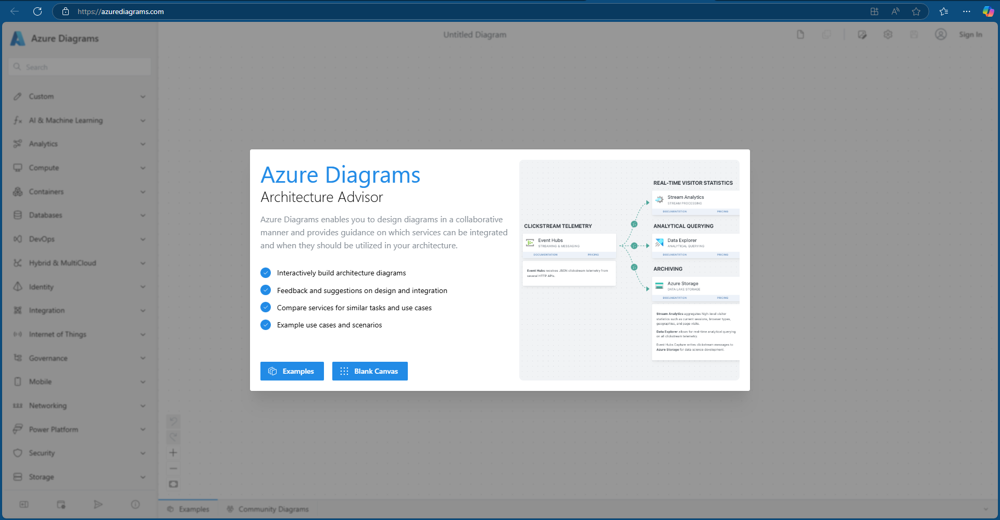

## Medallion アーキテクチャについて

メダリオン レイクハウス アーキテクチャ (一般に"メダリオン アーキテクチャ" と呼ばれます) は、組織がレイクハウス内のデータを論理的に整理するために使用する設計パターンです。 これは Fabric に推奨される設計アプローチです。

メダリオン アーキテクチャは、3 つの異なるレイヤー (ゾーン) で構成されています。 各レイヤーは、レイクハウスに保存されているデータの品質を示し、高いレベルは高い品質を表します。 この多層アプローチは、エンタープライズ データ製品にとっての信頼できる唯一のソースを構築するのに役立ちます。

重要なことは、メダリオンアーキテクチャは、データがレイヤーを通過する際に、原子性、一貫性、分離、耐久性（ACID）を保証することです。 生データから始まり、一連の検証と変換により、効率的な分析用に最適化されたデータが作られます。 メダリオン ステージには、ブロンズ (生)、シルバー (検証済み)、ゴールド (強化) の 3 つのステージがあります。

今回の演習の目標は Fabric のアーキテクチャをハンズオンでビルドして、グループで共有する事です。
人の作り方や好みによって、自然に図の見た目のバリエーションがあります。
最も大切なのは、**自分のFabricの理解を深める事です。**

## Azure Diagrams について
この演習では、無料ツールのAzure Diagramsを使用し、Fabricのアーキテクチャを説明する図を作成します。

Azure Diagramsは、Microsoft の公式なツールではありません。Microsoft の社員がアーキテクチャを説明するために作った便利なリソースです。
費用は一切かかりませんが、会社のセキュリティーおよびコンプライアンスのポリシーに従ってアカウントを作るか判断してください。
今日の演習では、アカウント無しでも実施ができますので、アカウント作成は受講者の自由となります。

Fabricだけではなく、他にもアーキテクチャの図は作成可能：
- Azure
- Power Platform・Dynamics 365
- マイクロソフト以外のベンダー（GCP、AWS等）

## Azure Diagramsへのアクセスと準備

先ずは以下のリンクをブラウザの別タブでアクセスしてください。

<!-- This link format lets us open in a seperate tab 😇 -->
<a href="https://azurediagrams.com/" target="_blank">https://azurediagrams.com</a>

ツールの案内と説明

### **任意**: アカウントの登録

## Fabricのサンプル アーキテクチャ図を確認する

サンプルとして含まれているモデルの確認

## Fabricのアーキテクチャ図を作成する

<!-- ❗永田さん！こちらの手順はどうすればいいのか、指定していただくか、書いていただければ助かります！他のセクションは任せてください❗ -->
Medallionを説明するアーキテクチャ図を作る手順

## 図のエクスポートと共有

当日はTeamsを使っているか確認

## リソース

Fabricについてのリソースここに
